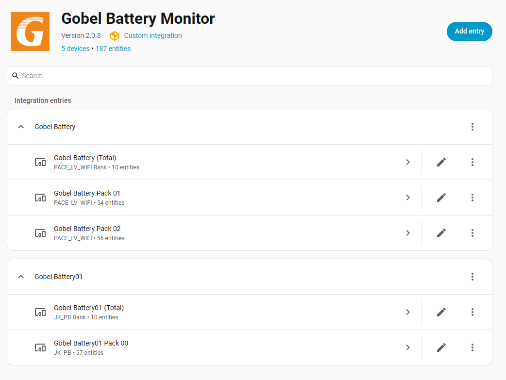

# Gobel Power 电池 Home Assistant 原生集成 (支持 JK BMS, Pace BMS, TDT BMS)

[English](../../README.md) | [Deutsch](../de/README.md)

> **注意**：寻找 ioBroker 版本？请访问 [ioBroker Gobel BMS Monitor 适配器](https://github.com/fancyui/ioBroker.gobel-bms-monitor)。

最强大的智能储能电池监控 Home Assistant 原生集成。此集成可直接与运行 Pace BMS、JK BMS 或 TDT BMS 硬件的 LiFePO4 电池包进行通信，并将其状态注册为 Home Assistant 的原生实体。

与之前的 Add-on（插件）版本不同，**此集成不需要 MQTT Broker**。它直接在 Home Assistant 内部创建设备和传感器实体，并通过可视化配置界面支持多设备安装（例如监控具有不同 IP/串口的多个电池组）。

---

## 主要功能与特点：
* **多 BMS 兼容性：** 原生支持 Pace BMS（RS232/RS485/WiFi）、JK BMS（55AA 被动广播协议）和 TDT BMS（RS232）。
* **灵活的连接选项：** 支持通过 RS232-USB 转接线、RS232 转以太网、RS232 转 WiFi、RS485 转以太网或 RS485 转 WiFi 进行硬件连接。
* **直接传感器集成 (无需 MQTT)：** 直接在 Home Assistant 内部创建单体电芯电压、容量、电流、温度和故障报警的 native 传感器。
* **动态多设备分组：** 将总体指标（如总 SOC、总电压、总电流、总功率）归类于一个“Total 设备”中，并为每个并联的电池包（兼容主机-从机拨码结构）自动创建“Pack 子设备”。
* **图形化配置流 (Config Flow)：** 直接通过 HA 的“设备与服务”菜单进行添加与配置。无需修改任何 YAML 文件、输入命令行或手动编写配置文件。

---

## 仪表盘示例：

---

## Pace BMS 接线与配置指南：
- **需要使用 RS232-WIFI/Ethernet 模块或 RS232-USB 转接线**
- **连接接口**：将 Home Assistant 连接至 Pace BMS 的 **RS232** 或 **WIFI** 接口。
- **主机 BMS**：连接必须接入到**主机 (Master) BMS** 上。
- **拨码开关设置**：请确保主机 BMS 的拨码开关（DIP switch）设置为 **1000**。

## JK BMS 接线与配置指南：
- **需要使用 RS485-WIFI/Ethernet 模块或 RS485-USB 转接线**
- **连接接口**：将 Home Assistant 连接至 JK BMS 的 **RS485B** 或 **RS485C** 接口。
- **主机 BMS**：连接必须接入到**主机 (Master) BMS** 上。
- **拨码开关设置**：请确保主机 BMS 的拨码开关（DIP switch）设置为 **0000**。

---

## 安装步骤：

### 选项 1：通过 HACS 安装（推荐）
1. 确保您的 Home Assistant 已安装 [HACS](https://hacs.xyz/)。
2. 打开 HA，进入 **HACS -> Integrations（集成）** 页面。
3. 点击右上角的三点菜单，选择 **自定义存储库（Custom repositories）**。
4. 粘贴本仓库地址：`https://github.com/fancyui/Gobel-Battery-HA-Integration`
5. 类别（Category）选择 **Integration（集成）**，然后点击 **添加**。
6. 在商店列表中找到 **Gobel Battery Monitor** 并点击 **下载**。
7. 重启 Home Assistant。

### 选项 2：手动拷贝安装
1. 下载最新发布版本的 Zip 包。
2. 解压并将 `custom_components/gobel_battery` 文件夹拷贝到 Home Assistant 的 `/config/custom_components/` 目录下。
3. 重启 Home Assistant。

---

## 配置方法：
1. 进入 Home Assistant 的 **设置 -> 设备与服务** 页面。
2. 点击右下角的 **添加集成**。
3. 搜索并选择 **Gobel Battery Monitor**。
4. 按照屏幕提示，选择您的 BMS 类型、连接方式（网络 vs 串口），并输入相应的连接参数。
5. 如果您有多组独立的电池（连接至不同的 IP 或串口），只需再次点击 **添加集成** 独立进行配置即可。
